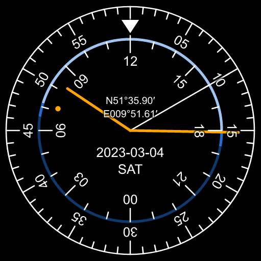

# Twenty-four hours clock

A Vanilla JavaScript [web component](https://www.webcomponents.org/) which displays a self-contained twenty-four hours clock with a scale for night, twilight and day.



For a demo see https://fboes.github.io/twentyfour-hours-clock/dist/.

## Installation

Either download the [`twentyfour-hours-clock.js`](twentyfour-hours-clock.js) to a sensible location in your web project, or do a NPM installation:

```bash
npm install twentyfour-hours-clock --save
```

Instead of a local installation you may also load the library from https://unpkg.com/. Beware: This makes https://unpkg.com/ a dependency of your project and may pose data protection issues.

```html
<script
  type="module"
  src="https://unpkg.com/twentyfour-hours-clock@latest/dist/twentyfour-hours-clock.js"
></script>
```

Everything required for the front-end functionality of this web component is contained in [`twentyfour-hours-clock.js`](./dist/twentyfour-hours-clock.js).

---

## Usage

Loading the library prior to use:

```html
<!-- load element library -->
<script type="module" src="twentyfour-hours-clock.js"></script>
```

Invoke a new instance by placing this into your HTML source code:

<!--
```
<custom-element-demo>
  <template>
    <script type="module" src="https://unpkg.com/twentyfour-hours-clock@latest/dist/twentyfour-hours-clock.js"></script>
    <next-code-block></next-code-block>
  </template>
</custom-element-demo>
```
-->

```html
<!-- use element -->
<twentyfour-hours-clock></twentyfour-hours-clock>
```

## Properties

Properties can be set on initialization via HTML attributes, or selecting the DOM node via JavaScript and setting the properties of the DOM node.

| Name              | Type                  | Default      | Description                                                                                                                                                                                                 |
| ----------------- | --------------------- | ------------ | ----------------------------------------------------------------------------------------------------------------------------------------------------------------------------------------------------------- |
| `width`           | ?`number`             | `512`        | Width of element in pixels                                                                                                                                                                                  |
| `height`          | ?`number`             | `512`        | Height of element in pixels                                                                                                                                                                                 |
| `datetime`        | ?`string`             | current date | String to set clock to (see [`Date`](https://developer.mozilla.org/en-US/docs/Web/JavaScript/Reference/Global_Objects/Date/parse)). Will be set to current time if empty. Example: `2011-10-10T14:48:00`.\* |
| `longitude`       | ?`number` \| `"auto"` | `undefined`  | Decimal longitude. Set to `"auto"` to ask browser for geolocation                                                                                                                                           |
| `latitude`        | ?`number` \| `"auto"` | `undefined`  | Decimal latitude. Set to `"auto"` to ask browser for geolocation                                                                                                                                            |
| `frequency`       | ?`number`             | `1`          | How many times per second should the clock be updated. `0` makes the clock static, as a number small than `1` will remove the second hand.                                                                  |
| `twilight-degree` | ?`number`             | `-6`         | At this sun elevation the clock changes from twilight to night.                                                                                                                                             |

Types prefixed with `?` allow setting value to `undefined` as well.

(\*) Please note that there is no way to supply a time zone to `datetime` as of now. The supplied time will always use the local user agent time zone.

## Methods

There are no public methods.

## Events

There are no events.

## Styling

To change the layout of the clock component use CSS variables. There is a set of defined CSS variables which you may use:

```css
twentyfour-hours-clock {
  --font-family: sans-serif;
  --color-background: black;
  --color-foreground: white;
  --color-watchhand: orange;
  --color-night: #0f396c;
  --color-twilight: #1d6fd3;
  --color-day: #a1c5f2;
  --stroke-width: 1px;
  --stroke-width-watchhand: 2px;
  --stroke-width-daylight: 2px;
}
```

## Browser compatibility

See [compatibility chart](https://caniuse.com/#search=web%20components):

- Google Chrome 67+
- Mozilla Firefox 63+
- Microsoft Edge 79+
- Opera 64+

If you need extended compatibility, search for [Web Components Polyfills](https://www.webcomponents.org/polyfills/).

---

## Development

- Run `tsc --build`.

## Status

[](https://badge.fury.io/gh/fboes%2Ftwentyfour-hours-clock)
[](https://badge.fury.io/js/twentyfour-hours-clock)
[](https://www.webcomponents.org/element/twentyfour-hours-clock)


## Legal stuff

Author: [Frank Boës](https://3960.org)

Copyright & license: See [LICENSE.txt](LICENSE.txt)
